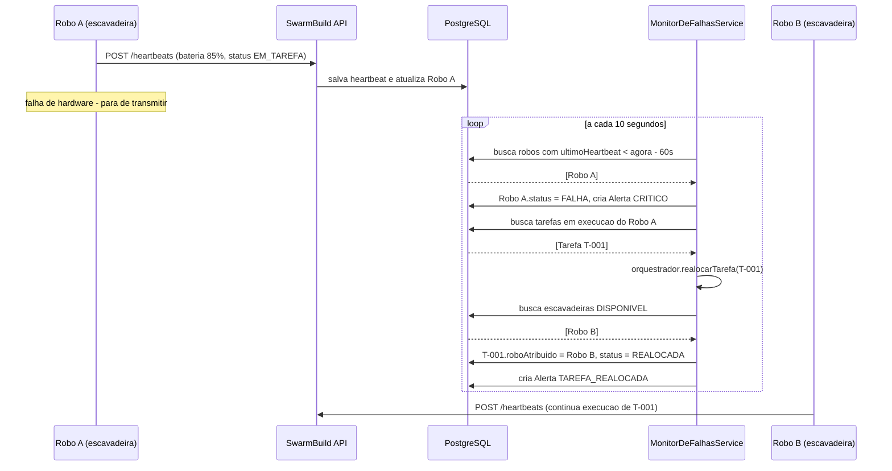

# Global Solution Space Connect 2026 

**API REST de orquestração de enxame robótico autônomo para construção de infraestrutura em ambientes hostis (base lunar).**

---

## Integrantes do grupo

| RM | Nome |
|--------|------|
| 554981 | Bruno Gabriel Silva Dominicheli |
| 555528 | Gabriel Gouvea Marques de Oliveira |
| 556198 | Miguel Kapicius Caires |
| 555608 | Thiago Ferreira Oliveira |

---

## Sobre a Global Solution — Space Connect

A Global Solution **Space Connect** desafia os alunos a:

> _"propor soluções que usem tecnologia, dados e inovação para resolver desafios na Terra,
> expandir as possibilidades da economia espacial e criar oportunidades para o futuro."_

A solução pode atacar problemas **da Terra**, **do espaço** ou da **integração entre os dois**, explorando
dados de satélite, conectividade, logística, sustentabilidade ou **sistemas autônomos**.

O **nosso projeto** se encaixa diretamente em uma das áreas de aplicação oficiais do tema:
**sistemas autônomos e robótica espacial**. Ele também é um caso clássico de **integração Terra ↔ espaço**:
a mesma inteligência de enxame que coordena robôs na Lua serve para missões de alto risco aqui na Terra.

---

## O problema que o nosso projeto resolve

O programa Artemis pretende **construir uma base lunar antes** da chegada dos astronautas.
Quem constrói são **robôs**. Mas o ambiente lunar é implacável: **poeira abrasiva**, **terreno irregular**
e radiação. Pior: a Terra está a mais de **380 mil km**, com **delay de comunicação de até 3 segundos** —
não dá para esperar um operador em Houston decidir o que fazer toda vez que um robô trava.

O **Nosso projeto** é a camada de software que **orquestra o enxame de forma autônoma**:

1. Cada robô envia um **heartbeat** periódico (bateria, posição, status).
2. Se um robô **para de responder**, o sistema **detecta a falha automaticamente**.
3. A tarefa do robô falho é **realocada para outro robô compatível** que esteja disponível —
   **sem intervenção humana**.
4. Todo evento crítico vira um **alerta** persistido no banco, formando o histórico da missão.

**A regra de ouro:** _falhas individuais não podem parar a missão._

---

## Alinhamento com o tema e com os ODS

| Eixo do Space Connect | Como o Nosso projeto atende |
|-----------------------|--------------------------|
| **Sistemas autônomos** | Detecção de falha + realocação de tarefas sem operador humano |
| **Economia espacial** | Viabiliza construção robótica de infraestrutura lunar antes da chegada humana |
| **Oportunidades futuras** | Arquitetura reaproveitável para mineração, resgate e operação em zonas hostis |
| **Integração Terra ↔ espaço** | Mesma lógica de enxame aplicada à Lua e a cenários terrestres de alto risco |

### Objetivos de Desenvolvimento Sustentável (ODS)

| ODS | Conexão |
|-----|---------|
| **9 – Indústria, inovação e infraestrutura** | Construção autônoma e resiliente de infraestrutura (foco principal) |
| **8 – Trabalho decente e crescimento econômico** | Robôs assumem tarefas letais; impulsiona a nascente economia espacial |
| **11 – Cidades e comunidades sustentáveis** | Spin-off: varredura coordenada em resgate a desastres |
| **13 – Ação climática** | Spin-off: resposta rápida a desastres naturais |

---

## Aplicação na Terra (spin-off)

A mesma inteligência de enxame, fora da Lua:

- **Mineração em zonas de alto risco** — robôs escavando onde seria mortal mandar humanos
- **Resgate em desastres** — varredura coordenada de escombros após terremotos
- **Construção em zonas radioativas** — descomissionamento de reatores

Em todos esses cenários a regra é a mesma: **falhas individuais não podem parar a missão.**

---

## Como o sistema integra com o problema

```
+---------------+   heartbeat   +-------------+   realoca   +---------------+
|  Robo na Lua  | ------------> | SwarmBuild  | ----------> |  Outro Robo   |
|  (escavadeira)|   bateria,    |   (API)     |   tarefa    |  (escavadeira)|
+---------------+   posicao,    +-------------+             +---------------+
                    status              |
                                        v
                                +---------------+
                                |   Alertas     |
                                |   (BD)        |
                                +---------------+
```

1. Cada robô do enxame envia heartbeat para `POST /api/robos/{id}/heartbeats`
2. O `MonitorDeFalhasService` roda a cada 10 segundos verificando quem não respondeu
3. Se `ultimoHeartbeat < agora - 60s`, o robô é marcado como `FALHA`
4. As tarefas que ele executava são **automaticamente realocadas** para outro robô do
   mesmo tipo via `OrquestradorEnxame`
5. Todo evento crítico gera um `Alerta` armazenado no banco

---

## Diagrama de fluxo — realocação automática



---

## Arquitetura

Aplicação em camadas, organizada por responsabilidade:

```
controller/   -> camada web (REST): recebe requisições, devolve DTOs e status HTTP
service/      -> regras de negócio (orquestração, monitoramento, validações)
repository/   -> acesso a dados (Spring Data JPA)
model/        -> entidades JPA + enums + Value Object (Coordenada)
dto/          -> objetos de entrada/saída (records) - desacoplam a API do modelo
exception/    -> exceções customizadas + handler global (@RestControllerAdvice)
```

**Destaques de arquitetura:**

- **`OrquestradorEnxame` é uma interface**, implementada por `OrquestradorEnxameImpl` e injetada
  via construtor nos serviços (inversão de dependência / baixo acoplamento).
- **`MonitorDeFalhasService`** usa `@Scheduled` para rodar a detecção de falhas em segundo plano.
- **`GlobalExceptionHandler`** centraliza o tratamento de erros e devolve respostas JSON padronizadas.

### Modelo de domínio

`Robo` é uma **classe abstrata** com três subclasses concretas (herança + polimorfismo):

```
Robo (abstract)
├── RoboEscavadeira    -> escava (capacidade de carga, profundidade máxima)
├── RoboTransportador  -> transporta (capacidade de carga, velocidade)
└── RoboMontador       -> monta (precisão, número de braços)
```

| Entidade | Papel |
|----------|-------|
| `Robo` (abstract) | Robô do enxame; mapeado por herança JPA (`SINGLE_TABLE`) |
| `Tarefa` | Trabalho a ser executado por um robô de um tipo específico |
| `Heartbeat` | Pulso periódico do robô (bateria, posição, status) |
| `Alerta` | Evento crítico registrado (offline, bateria baixa, realocação, sem robô) |
| `Coordenada` | **Value Object** (`@Embeddable`, record) com latitude/longitude |

---

## Stack

- **Java 21**
- **Spring Boot 3.5.7** (web, data-jpa, validation)
- **PostgreSQL 18**
- **Springdoc OpenAPI 2.8.13** (Swagger UI / OAS 3.1)
- **JUnit 5 + Mockito** (testes)
- **Maven** (via wrapper `./mvnw`)

---

## Documentação interativa (Swagger / OpenAPI)

Com a aplicação no ar:

- **Swagger UI** → **http://localhost:8080/swagger-ui.html**
- **Documento OpenAPI / OAS 3.1** → **http://localhost:8080/api-docs**

⚠️ O caminho do JSON foi customizado para `/api-docs` (em vez do padrão `/v3/api-docs`)

---

## Endpoints

### Robôs

| Método | Caminho | Descrição |
|--------|---------|-----------|
| POST   | `/api/robos`              | Cria robô (escavadeira/transportador/montador) |
| GET    | `/api/robos`              | Lista todos |
| GET    | `/api/robos/{id}`         | Detalhe |
| PATCH  | `/api/robos/{id}/status`  | Atualiza status manualmente |
| DELETE | `/api/robos/{id}`         | Remove (bloqueado se `EM_TAREFA`) |

### Tarefas

| Método | Caminho | Descrição |
|--------|---------|-----------|
| POST   | `/api/tarefas`                        | Cria tarefa |
| GET    | `/api/tarefas`                        | Lista |
| GET    | `/api/tarefas/{id}`                   | Detalhe |
| POST   | `/api/tarefas/{id}/atribuir`          | Atribui automaticamente ao melhor robô |
| POST   | `/api/tarefas/{id}/atribuir/{roboId}` | Atribui a um robô específico |
| POST   | `/api/tarefas/{id}/concluir`          | Marca como concluída |
| POST   | `/api/tarefas/{id}/realocar`          | Força realocação para outro robô |
| DELETE | `/api/tarefas/{id}`                   | Remove |

### Heartbeats

| Método | Caminho | Descrição |
|--------|---------|-----------|
| POST   | `/api/robos/{roboId}/heartbeats` | Registra heartbeat |
| GET    | `/api/robos/{roboId}/heartbeats` | Histórico do robô |

### Alertas

| Método | Caminho | Descrição |
|--------|---------|-----------|
| GET    | `/api/alertas`               | Lista (filtro `?resolvido=false`) |
| GET    | `/api/alertas/{id}`          | Detalhe |
| POST   | `/api/alertas/{id}/resolver` | Marca como resolvido |

---

## Regras de negócio implementadas

1. **Heartbeat** — cada robô envia status periodicamente; o serviço atualiza posição, bateria
   e `ultimoHeartbeat`. Se a bateria cai abaixo de 20% gera alerta `BATERIA_BAIXA`.
2. **Detecção de falha** — job `@Scheduled` roda a cada 10s e marca como `FALHA`
   quem não mandou heartbeat há mais de 60s.
3. **Realocação automática** — tarefas em execução do robô falho são realocadas para outro robô
   do mesmo tipo via `OrquestradorEnxame.realocarTarefa()`. O robô anterior **saudável** é liberado
   de volta para `DISPONIVEL`; se estava em `FALHA`, permanece em falha. Sem substituto disponível,
   gera alerta `TAREFA_SEM_ROBO_DISPONIVEL`.
4. **Atribuição inteligente** — ao atribuir uma tarefa, escolhe o robô do tipo correto **mais próximo**
   do local (distância euclidiana entre coordenadas).
5. **Código único** — robô e tarefa têm `codigo` único (lança `CodigoDuplicadoException`, HTTP 409).
6. **Bloqueio de remoção** — não permite deletar robô em tarefa nem com tarefas ativas; ao remover,
   o histórico (alertas/tarefas concluídas) é preservado com a referência ao robô zerada.
7. **Recuperação automática** — se um robô em `FALHA` voltar a mandar heartbeat reportando outro
   status, é movido de volta para `DISPONIVEL`.

---

## Testes

Testes automatizados com **JUnit 5 + Mockito** (24 testes no total):

| Arquivo | O que valida |
|---------|--------------|
| `CoordenadaTest` | Value Object: igualdade e cálculo de distância |
| `RoboPolimorfismoTest` | Herança e polimorfismo das subclasses de `Robo` |
| `TarefaTest` | Ciclo de vida da tarefa (atribuir, concluir, realocar) |
| `OrquestradorEnxameTest` | Núcleo da inteligência: escolha do melhor robô, realocação, alertas |

```bash
./mvnw test
```

---

## Mapeamento dos requisitos do professor

| Requisito | Onde está no código |
|-----------|---------------------|
| Classes públicas, privadas, estáticas | `Robo.aoCriar()` (protected), construtores públicos, factory `RoboResponseDTO.de(...)` (static) |
| Herança | `Robo` (abstract) → `RoboEscavadeira`, `RoboTransportador`, `RoboMontador` |
| Polimorfismo | `getTipo()` e `descricaoCapacidade()` são abstratos e cada subclasse implementa diferente |
| Classes abstratas | `Robo` é `abstract` |
| Interfaces + injeção de dependência | `OrquestradorEnxame` (interface) injetado em `RoboService`, `TarefaService`, `MonitorDeFalhasService` |
| Modularização em métodos | Serviços divididos por responsabilidade; métodos privados auxiliares no orquestrador e no monitor |
| Manipulação de DateTime | `LocalDateTime` em heartbeat, tarefas e alertas; `MonitorDeFalhasService.detectarRobosOffline()` |
| Estruturas de controle | Laços e condicionais na detecção de falhas, atribuição e realocação |
| Tratamento de exceções | Pacote `exception/` com exceções customizadas + `GlobalExceptionHandler` (`@RestControllerAdvice`) |
| VO / DTO | `Coordenada` (record + `@Embeddable` = VO) e records em `dto/` |
| Banco de dados | PostgreSQL + JPA com `@Entity`, `@Inheritance`, `@Embedded`, `@ManyToOne` |
| WebService / API | Controllers REST em `controller/` com CRUD completo + documentação Swagger/OAS |
| Testes | JUnit 5 + Mockito (24 testes) |
| Organização | Pacotes `controller`, `service`, `repository`, `model`, `dto`, `exception` |
